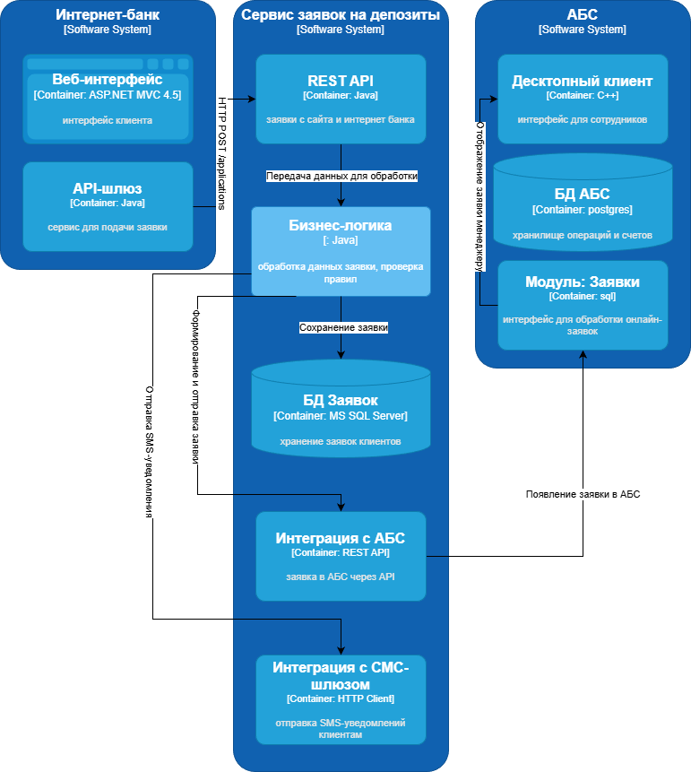
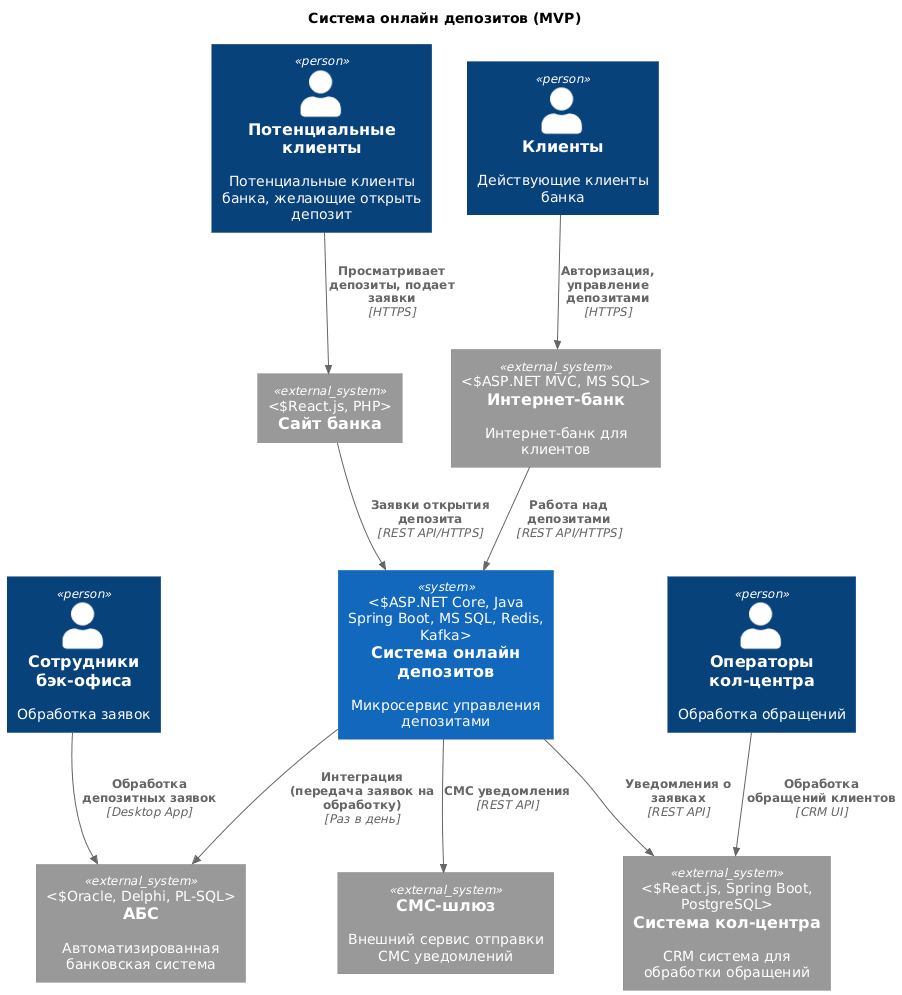

### Открытие депозитов онлайн
### Марунич Денис
### 22.12.205
### **Функциональные требования**

|**№**|**Действующие лица или системы**|**Use Case**|**Описание**|
| :-: | :- | :- | :- |
|1|Клиент|Просмотр депозитов на сайте|Клиент заходит на сайт банка, переходит на страницу депозитов, система загружает список депозитов из кэша, клиент видит актуальные ставки и условия, может подать заявку, указав номер телефона и Ф.И.О.|
|2|Клиент|Подача заявки в интернет-банке|Клиент авторизуется в интернет-банке, выбирает депозит, система показывает персонализированные условия, клиент указывает сумму и счет для списания, система отправляет SMS-код для подтверждения, клиент вводит код, система создает заявку и отправляет в очередь, отправляет SMS-уведомление о получении заявки|
|3|Менеджер кол-центра|Обработка заявки с сайта|Менеджер видит новую заявку в системе кол-центра, связывается с клиентом, уточняет детали и предлагает условия, подтверждает заявку в системе|
|4|Сотрудник бэк-офиса|Подтверждение заявки из интернет-банка|Сотрудник видит заявку в системе бэк-офиса, проверяет данные клиента, подтверждает условия депозита в АБС, система отправляет SMS-уведомление об открытии депозита|
|5|Сотрудник бэк-офиса|Управление ставками|Сотрудник загружает XLS-файл со ставками, система обрабатывает файл и обновляет справочник, очищает кэш ставок, отправляет уведомления об обновлении|

### **Нефункциональные требования**

|**№**|**Требование**|
| :-: | :- |
|1|Доступность системы 99.9%|
|2|Время отклика системы < 1 секунды|
|3|Успешная обработка 95% заявок|
|4|Отсутствие перегрузки АБС|
|5|Шифрование трафика (HTTPS/TLS)|
|6|Безопасная аутентификация клиентов|
|7|Разделение доступа между отделами|
|8|Аудит всех операций|
|9|Горизонтальное масштабирование интернет-банка|
|10|Вертикальное масштабирование АБС|
|11|Резервирование всех критичных компонентов|
|12|Автоматическое переключение при сбоях|
|13|Распределение нагрузки между ЦОД|
|14|Использование существующих технологий банка|
|15|Совместимость с MS SQL и Oracle|
|16|Переиспользование существующих компонентов|
### **Решение**

### **Альтернативы**
| **№** | **Наименование**                                                  | **Причина отказа**                                                                                                                     |
|:-----:|:------------------------------------------------------------------|:---------------------------------------------------------------------------------------------------------------------------------------|
|   1   | Использование базы данных АБС для работы через интернет банк      | нарушение консистентности критически важных данных                                                                                     |
|   2   | Использование  бд АБС для работы с заявками                       | лишняя нагрузка на бд для работы с менее важными данными                                                                               |
|   3   | Внедрение асихронной передачи с использованием rabbitmq или kafka | избыточная модификация для существующей нагрузки на систему; внедрение сьест ресурсы команды, у коротой нет соответствующей экспертизы |

**Недостатки, ограничения, риски**
| **№** | **Наименование**                                                  | **Недостатки, ограничения, риски**                                                                                                     |
|:-----:|:------------------------------------------------------------------|:---------------------------------------------------------------------------------------------------------------------------------------|
|   1   | Добавление нового модуля "Заявки на депозиты"                     | ресурсы команды                                                                                                                        |
|   2   | Увеличение сложности системы из за внедрения новых компонентов    | поддержка, мониторинг новых сервисов                                                                                                   |
|   3   | Внедрение асихронной передачи с использованием rabbitmq или kafka | избыточная модификация для существующей нагрузки на систему; внедрение сьест ресурсы команды, у коротой нет соответствующей экспертизы |
|   4   | Привлечение ресурсов для бэк офиса                                | аудит и оптимизация работы бэк офиса в связи потенциальным ростом нагрузки по заявкам                                                  |