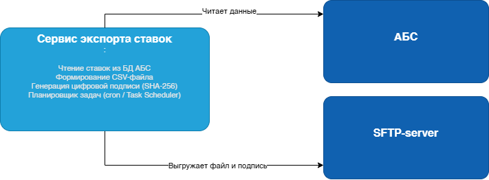
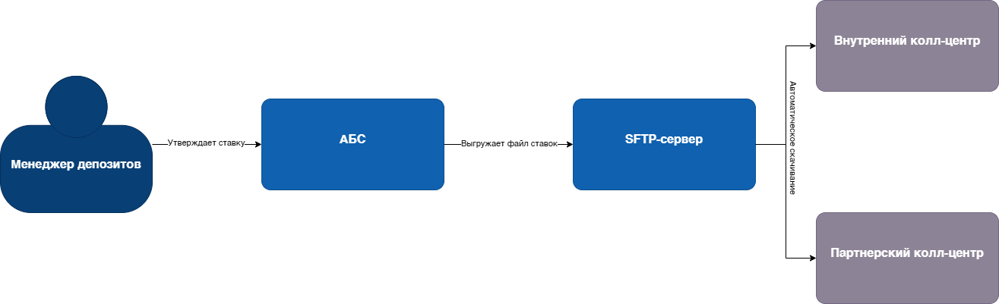

### <a name="_b7urdng99y53">Передача актуальных ставок по депозитам в кол-центр — MVP</a>
### <a name="_hjk0fkfyohdk">Денис Маарунич</a>
### <a name="_uanumrh8zrui">22 декабря 2025</a>
### **Функциональные требования**
|№|Субьект|Сценарий| Описание                                                                                                           |
| :-: | :- | :- |:-------------------------------------------------------------------------------------------------------------------|
| 1 | Менеджер | Утверждение ставки | Менеджер в АБС утверждает новую ставку по депозиту. Система фиксирует её как актуальную.                           |
| 2 | АБС | Экспорт файла ставок | Раз в 2 часа система формирует файл c информацией по ставкам и выкладывает его на SFTP-сервер.                     |
| 3 | Внутренний кол-центр | Получение файла ставок | Crm система внутреннего кол-центра автоматически скачивает файл с SFTP и использует его для консультаций клиентов. |
| 4 | Партнёрский кол-центр | Получение файла ставок | Crm система партнёрского кол-центра скачивает файл по SFTP и обновляет данные по депозитам.                        |

Нефункциональные требования
|№|Требование|
| :-: | :- |
| 1 | Файл должен обновляться не реже чем 1 раз в час  |
| 2 | Документ с информацией по ставкам депозитов формируется в pdf формате |
| 3 | Документ должен содержать информацию о продукте: ставке, сроке, минимальная сумме |
| 4 | Доступ к файлу — только по защищённому SFTP-каналу |
| 5 | Процесс должен быть полностью автоматизирован — без ручного участия |
| 6 | Система должна выдерживать нагрузку при массовых звонках клиентов |

Решение
Для обеспечения операторов кол-центров актуальными ставками предлагается реализовать **автоматизированный экспорт данных из АБС в виде файла**, доступного по SFTP.

### Диаграммы

### Логика принятия решений и выбора технологий

- **SFTP + файлы** — единственный допустимый способ интеграции с партнёром (API запрещены).
- **PDF** — универсальный формат, поддерживается всеми системами.
- **Java/Oracle** — используются в АБС, есть экспертиза у команды.

Альтернативы

| Альтернатива | Почему не выбрана |
|--------------|-------------------|
| Передача ставок через API | Запрещено партнёрским кол-центром — нет возможности принимать HTTP-запросы |
| Ручная отправка Excel по email | Небезопасно, нет аудита, высокий риск ошибок — не соответствует целям цифровизации |
| Хранение ставок в интернет-банке и сайт | Кол-центр не имеет доступа к этим системам — не решает проблему |
| Использование Kafka или очередей | Избыточно — требуется только файловая выгрузка, нет нужды в потоковой передаче |

Недостатки, ограничения, риски
1. **Формирование фалйа раз в промежуток времени** — если ставка изменена, кол-центр узнает об этом только после следующего экспорта.
2. **Зависимость от SFTP-инфраструктуры** — если сервер упадёт, кол-центр останется без данных.
3. **Партнёр зависит от внешнего для него источника актуальной информации** — сбой в получении актуальной информации.
4. **Нет обратной связи** — банк не знает, получил ли партнёр файл.
5. **Ограниченная гибкость** — нельзя передавать сложную логику (например, персонализированные ставки).

### RoadMap: Передача ставок в кол-центр